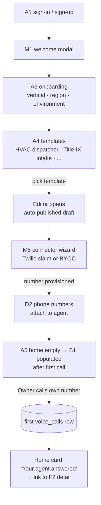
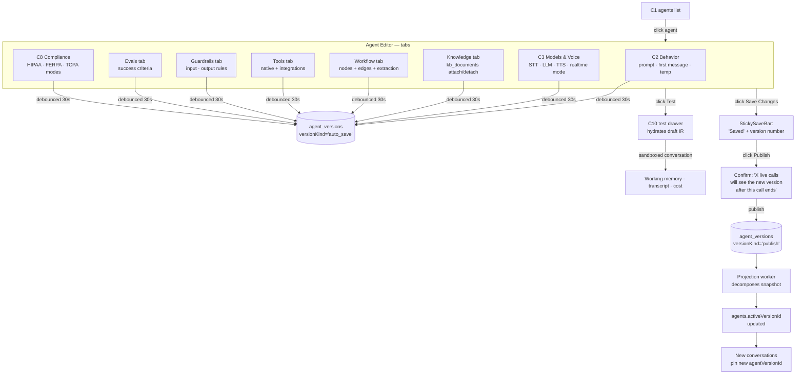
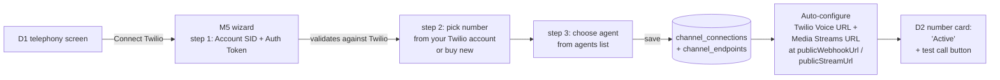
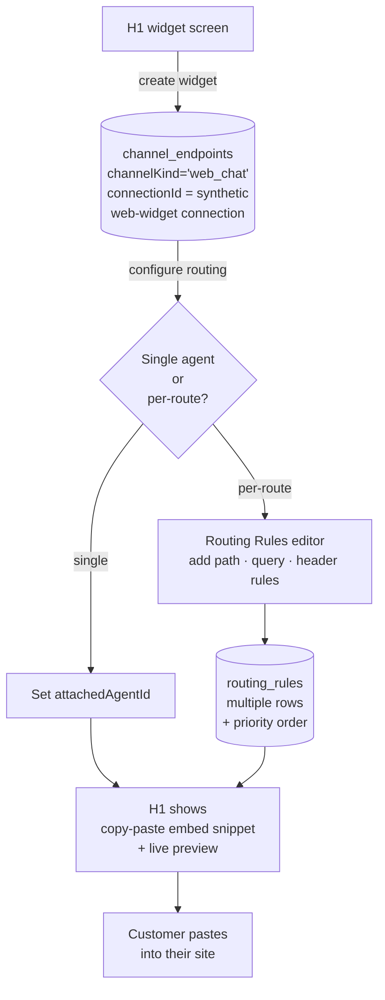
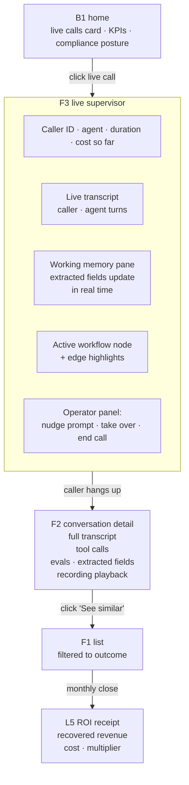
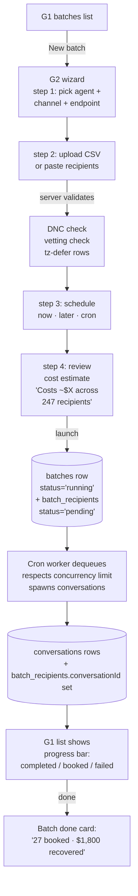
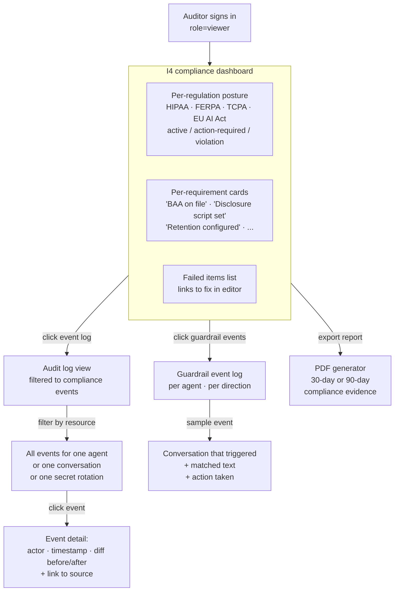
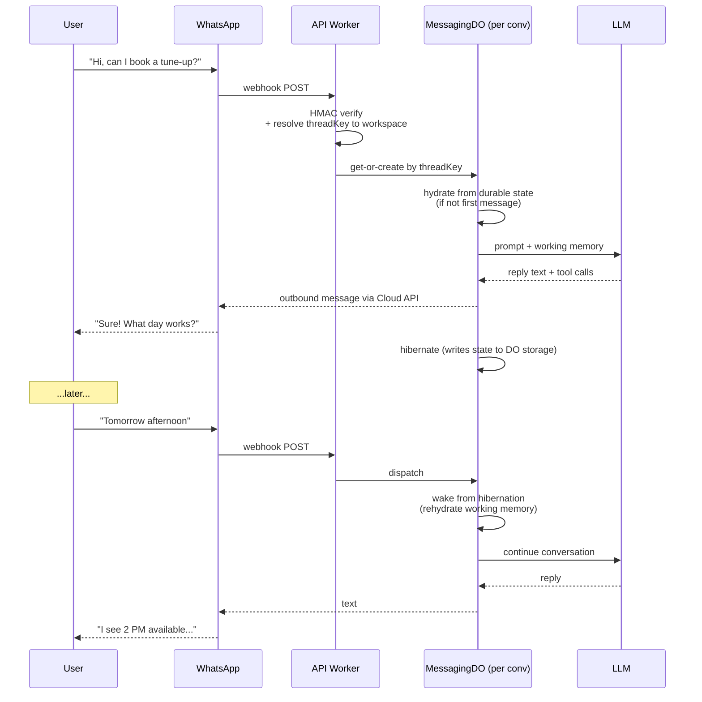

# Kuralle · User Journeys

Grounded in: `DATA_MODEL.md` (schema), `HEXAGONAL_ARCHITECTURE.md` (platform),
`screens/COMPONENT-MAP.md` (existing UI), README persona statements (HVAC
owner-operator at 11 PM; Title-IX officer at 9 AM).

Screen IDs (A1, B1, C2, etc.) reference the existing screens shipped in
`apps/web/src/routes/`. Latency targets are derived from the council's
locked decisions and the sink-spike measurements.

---

## 1 · Personas

Five distinct users, each touching different surfaces.

| Persona | Role | Frequency | Trust moment |
|---|---|---|---|
| **Owner-Operator** (HVAC, plumbing, dental) | `owner` role; runs everything solo for first 6 months | Daily morning + after-hours | "Did the agent book that 11 PM call correctly?" |
| **Workspace Admin** | `admin` role at multi-seat orgs; configures agents, manages members | Weekly | "Did my changes go live without breaking calls?" |
| **Operations Lead** | `member` role; supervises live, reviews calls, intervenes | Daily | "Is this caller getting a good experience right now?" |
| **Compliance Officer / Auditor** | `viewer` role; HIPAA, FERPA, TCPA, internal audit | Weekly + on-incident | "Can I prove this PHI was never read by the wrong tenant?" |
| **End-User / Caller** | The person dialing the number or messaging the WhatsApp / widget | Per interaction | "Am I talking to a human? Will my problem actually get solved?" |

The end-user journey is the one most often forgotten in B2B platform design.
Kuralle's value depends on it being good — the operator's confidence is
downstream of the caller's experience.

---

## 2 · Cross-cutting promises

Three measurable user-facing commitments the architecture has to honor:

| Promise | Threshold | Backed by |
|---|---|---|
| **First call answered within 5 minutes of signup** | Median ≤ 5 min from `A1 sign-in` to first received `voice_calls` row | Fast onboarding flow + template-based agents + auto-Twilio number provisioning |
| **Publish latency stays sub-second from the user's POV** | Editor save bar shows "Saved" in < 200 ms; new calls hit new version within 5 sec | Synchronous projection on publish (council §49) + `agent_versions.activeVersionId` pointer swap |
| **Supervisor sees what the caller hears, in real time** | F3 supervisor screen lag from caller speech to displayed transcript ≤ 1.5 sec | RuntimeHost's WebSocket fanout + `runtime_sessions.sequenceNumber` polling fallback (council §24) |

Failures of any of these get logged to `audit_log_events` with a
user-experience-impact tag — they are the platform's own SLO.

---

## 3 · Journey 1 — First-run onboarding (Owner-Operator)

**Goal:** sign up → first call answered. Target: ≤ 7 minutes from email entry.



### What happens on the data model

| Step | Screen | Tables touched |
|---|---|---|
| Sign-up | A1 | `user`, `session` (better-auth) |
| Welcome | M1 | — |
| Onboarding | A3 | `organization` (workspace + `personal: true` if solo) + `member` (owner role) |
| Template pick | A4 | `agents` + `agent_versions` (versionKind='publish', from template seed) + `agent_tool_attachments` projection |
| Twilio connect | M5 | `secrets` (KMS-encrypted Twilio creds) + `channel_connections` (kind=voice, provider=twilio-native) |
| Number attach | D2 | `channel_endpoints` (channelKind=voice, attachedAgentId set, publicStreamUrl computed) |
| First call | (ringing) | `runtime_deployments` (CF Container provisioned for workspace) → `conversations` + `voice_calls` + `runtime_sessions` |
| Cold start | (n/a) | First-call cold-start ~3s; subsequent calls ≤ 200ms attach |

### Failure modes the journey must absorb

- **Twilio creds wrong** → M5 wizard validates synchronously before saving `secrets`. User sees inline error, never a runtime failure.
- **First call lands during cold start** → Twilio's Media Streams handshake retries; the user hears one extra second of pause before the greeting. Logged but not a defect.
- **Template doesn't match vertical** → A4 filters templates by `organization.vertical` so the choices are pre-narrowed.

---

## 4 · Journey 2 — Building / editing an agent (Workspace Admin, repeated)

**Goal:** modify an agent's behavior, knowledge, tools, guardrails — and ship without breaking live traffic.



### The IR flow

The editor holds one `AgentIR` document in memory. Every tab edits the same
document. Saves and publishes go through `agents.publish({ id, ir })`:

1. **Auto-save** (every 30s debounced): `versionKind='auto_save'` row written;
   no projection, no `activeVersionId` change. Browser-tab-close-safe.
2. **Manual save** (sticky bar "Save Changes"): `versionKind='manual_save'`,
   no projection. Used for "I'm done editing for now, but not ready to ship."
3. **Publish**: `versionKind='publish'`, projection worker decomposes
   snapshot into `agent_tool_attachments`, `agent_kb_attachments`,
   `agent_guardrails`, `agent_eval_criteria`, `workflow_nodes_projection`.
   `agents.activeVersionId` updated. New conversations pin
   `agentVersionId = <new>`; in-flight conversations finish on the old.

### Test drawer (C10) — without publishing

C10 hydrates the *draft* IR (latest auto-save) into a sandboxed AriaFlow
runtime and runs a one-off conversation. Does NOT touch
`runtime_deployments`, does NOT count toward billing, does NOT emit to the
sink. The user sees: transcript, working memory snapshot, tool calls,
extracted fields, total cost estimate.

### What "saved without breaking calls" actually means

```
[ Live call started at T-10min  ]──pinned to agentVersionId=v17──┐
[ Live call started at T-3min   ]──pinned to agentVersionId=v17──┤
[ Publish at T0: v18 active     ]                                  │
[ New call started at T+5sec    ]──pinned to agentVersionId=v18──┘
                                  │
                            All in-flight calls
                            keep running on v17
                            until they end naturally.
                            v18 only affects new calls.
```

This is why `conversations.agentVersionId` is pinned at call start, not
resolved live. It's also why we never hot-swap mid-conversation.

### Compliance carve-out (HIPAA workspaces)

Editing the C8 Compliance tab and toggling HIPAA on/off is a special
publish — the next publish triggers re-deploys of every running container
under that workspace into the stricter isolation profile (per council
§57: 30-sec idle vs 5-min). Visible UX: an alert banner appears in the
editor warning that "5 live calls will end and re-route to a fresh
container after this publish; expect ~10s pause for affected callers."

---

## 5 · Journey 3 — Connecting a channel

**Goal:** add a phone number / WhatsApp number / web widget so the agent can take real conversations.

### 3a — Twilio voice (PSTN)



### 3b — WhatsApp Business

```mermaid
flowchart LR
    Settings[I1 settings →<br/>Channels] -->|Add WhatsApp| MetaOAuth[Meta OAuth<br/>via Embedded Signup]
    MetaOAuth -->|user grants permissions| MetaCallback[Callback hits API Worker]
    MetaCallback -->|Meta Graph API| FetchPhoneNumbers[List user's<br/>WhatsApp Business<br/>phone numbers]
    FetchPhoneNumbers -->|user picks one| RegisterWebhook[Register webhook URL<br/>= channel_endpoints.publicWebhookUrl]
    RegisterWebhook --> ChannelTables2[(channel_connections<br/>provider='meta-whatsapp-cloud'<br/>+ channel_endpoints<br/>identifier=phoneNumberId)]
    ChannelTables2 --> AttachAgent[Pick agent → set<br/>channel_endpoints.attachedAgentId]
    AttachAgent --> SendTestMessage[User sends test message<br/>from their phone]
    SendTestMessage -->|webhook fires| FirstWA[(conversations row<br/>channelKind='whatsapp'<br/>threadKey='whatsapp:wa_id')]
    FirstWA --> ConfirmCard[Settings card:<br/>'Connected · last message 2s ago']
```



### 3c — Web widget (multi-agent on one site)



### What goes wrong, and how the journey absorbs it

| Failure | UX |
|---|---|
| Twilio auth fails | M5 step 1 inline error before any DB write |
| WhatsApp number is on a different Meta Business Account | M5 surfaces all available numbers; if none, link to Meta Business Manager |
| Widget paste breaks customer's CSP | H1 shows CSP-friendly snippet variant + a "diagnostic" button that opens browser DevTools instructions |
| Webhook delivery fails after registration | `webhook_deliveries` retries; D2/H1 cards turn yellow ("delivery degraded") |

---

## 6 · Journey 4 — Live operations (Operations Lead, daily)

**Goal:** monitor live calls, intervene if needed, review post-call quality.



### Real-time mechanics

The F3 supervisor screen connects to the API Worker via WebSocket, which
proxies to the `WorkspaceVoiceDO` for the relevant workspace, which fans out
audio-tap and turn events from the running container.

Polling fallback: if the WebSocket drops, the screen falls back to
`SELECT sequenceNumber FROM runtime_sessions WHERE conversationId = $1`
every 500ms; new turns are loaded only when sequenceNumber advances.

### Operator interventions

Three explicit actions, each writes `audit_log_events`:

1. **Nudge prompt** — operator types a system message that gets injected
   into the agent's working memory at the next turn. Visible in transcript
   as `speaker='system'`.
2. **Take over** — agent's TTS muted; operator's voice (via browser mic)
   patched into the call. AriaFlow runtime continues to log turns but
   stops generating responses.
3. **End call** — sends `{tag:'hangup', by:'operator'}` to the runtime;
   conversation closes with `outcome='escalated'`.

### Trust moment for the operator

After a call ends, F2 shows the **bundleHash** the call ran against and
the **agentVersionId** pinned at start. So the operator can answer
"which version of the agent handled this call?" without ambiguity. Critical
when investigating a regression.

---

## 7 · Journey 5 — Outbound batch campaign

**Goal:** send 500 follow-up calls / WhatsApp messages from a CSV; watch them complete.



### Batch-specific UX details

- **Time-zone awareness** — recipient phone area-code-derived TZ; rows
  outside business hours get `status='deferred'` and `scheduledFor`
  shifted to next 9 AM in their TZ.
- **Concurrency control** — `batches.concurrency` limits in-flight calls.
  Default 8; HIPAA workspaces forced to 4 (slow burn for compliance
  reasons).
- **Pause / resume** — one click; runtime drains in-flight to completion,
  pending recipients freeze. Resume re-arms the scheduler.
- **Mid-batch agent edit** — if the user publishes a new agent version
  while a batch runs, the batch's *next* dial uses the new version.
  In-flight calls finish on whatever version they pinned at start.

---

## 8 · Journey 6 — Compliance officer review (Auditor, weekly)

**Goal:** answer "is this workspace compliant?" with evidence, not promises.



### What the auditor needs (and the schema delivers)

| Question | Answered by |
|---|---|
| "When did this agent last change?" | `agent_versions` rows for that agentId, sorted by publishedAt |
| "Who published this version?" | `agent_versions.publishedByUserId` + `audit_log_events` |
| "What changed between v17 and v18?" | `agent_versions.parentVersionId` chain + JSON diff via `audit_log_events.diff` |
| "Did this agent ever process PHI under non-HIPAA mode?" | `agent_versions.snapshot.complianceConfig` history × `conversations.agentVersionId` |
| "Was this caller's recording ever accessed?" | `audit_log_events` filtered to `event='conversation.recording.played'` for that conversationId |
| "Show all guardrail trips for HIPAA breaches" | `guardrail_events` JOIN `agent_guardrails` WHERE direction='output' |
| "What was the rubric used to score this conversation?" | `conversation_evals.rubricSnapshot` (locked at scoring time, never re-evaluated) |
| "How long are recordings kept?" | `agent_versions.snapshot.complianceConfig.retentionDays` + cold-archive policy |

### The 6-year HIPAA trail

Audit log events are partitioned monthly. Hot in Postgres for 90 days;
auto-archived to S3 Glacier Instant Retrieval thereafter, with a per-event
lookup index in Postgres so any single event can be pulled in < 5 sec
from cold storage. The auditor never sees the storage tier.

---

## 9 · Journey 7 — End-user (Caller / Messager)

The most important journey, often forgotten in B2B. The agent's value is
*entirely* downstream of the caller's experience.

### 9a — Voice caller (HVAC dispatcher use case at 11 PM)

```mermaid
sequenceDiagram
    participant Caller
    participant Twilio
    participant Worker as API Worker
    participant DO as WorkspaceVoiceDO
    participant Container as Container (Bun + AriaFlow)
    participant Deepgram
    participant LLM
    participant TTS

    Caller->>Twilio: dials HVAC number
    Twilio->>Worker: webhook POST (TwiML)
    Worker->>Worker: lookup channel_endpoints<br/>by E.164 → workspace + agent
    Worker-->>Twilio: TwiML <Connect><Stream url=publicStreamUrl>
    Twilio-->>Worker: opens WSS to publicStreamUrl
    Worker->>DO: route by workspaceId
    DO->>Container: ensure alive<br/>(spawn if cold ~3s; warm ~50ms)
    Container->>Container: AriaFlow Runtime<br/>session for this conv
    Container-->>Twilio: greeting audio (TTS)
    Note over Caller: "Calderon HVAC after-hours,<br/>how can I help?"

    loop Each turn
        Caller->>Twilio: speech (PCMU)
        Twilio->>Container: WSS frames
        Container->>Deepgram: STT WSS
        Deepgram-->>Container: text
        Container->>LLM: prompt + tools
        LLM-->>Container: response + tool calls
        Container->>TTS: synthesize
        TTS-->>Container: audio
        Container-->>Twilio: WSS frames
        Twilio-->>Caller: spoken response
    end

    Caller->>Twilio: hangup
    Twilio->>Container: close WSS
    Container->>Worker: emit final events
    Worker->>Worker: write conversation row<br/>+ outcome + recording key
```

**What the caller experiences:**

| Moment | Promise | Failure mode |
|---|---|---|
| Dial | Connect tone within 2 rings | Twilio carrier delay (out of scope) |
| First greeting | Spoken within 600ms of pick-up (warm) or 3s (cold) | Cold start visible as longer pause; never silent |
| Each response | Sub-second from end-of-speech to start-of-TTS | LLM latency dominates; AriaFlow's parallel STT/TTS pipeline mitigates |
| Interruption | Agent stops mid-sentence when caller speaks | VAD detection in Container; barge-in handled by AriaFlow |
| Tool execution | Agent says "let me check that" + ambient hold sound | `agents.snapshot.complianceConfig.toolCallSounds` |
| Handoff to human | Operator answers within 4 rings | F3 take-over flow; if no operator, falls back to voicemail |
| End | "Thanks, goodbye"; recording captured | `voice_calls.hangupBy = 'caller'` |

**The trust moments for the caller:**

1. **First 4 seconds** — does this sound like a person who can help, or a phone tree? The first message and voice config (`agent_versions.snapshot.voiceConfig`) are tuned to land warm.
2. **First refusal** — when the agent can't book or transfer, does it apologize and suggest a callback? This is on the disclosure script + transfer-to-number system tool.
3. **Caller knows it's an AI** — `disclosureMode='verbal'` means within the first 8 seconds the agent says "I'm an AI assistant." TCPA requirement, but also a trust signal.

### 9b — WhatsApp messager (booking flow)



**What's different from voice:**

- 24-hour window matters (`messaging_threads.windowExpiresAt`) — past 24h, agent can only send approved templates, not free-form text
- Hibernation is invisible to the user; reply latency is the same regardless of hibernated/awake
- Media (images, voice notes) flows through `mediaPayload` jsonb on `conversation_turns`
- No "live supervisor in real time" expectation — operators review post-conversation

### 9c — Web widget visitor

Visiting kuralle's customer's site, sees a chat bubble bottom-right.

```mermaid
flowchart LR
    Visitor[Visitor on customer's site] -->|widget loads| WidgetJS[widget.kuralle.com/embed.js]
    WidgetJS -->|opens WSS| Worker[API Worker<br/>publicStreamUrl]
    Worker -->|verify embed token| AuthCheck[verifyWidgetToken]
    AuthCheck -->|workspace + endpoint resolved| RoutingCheck{routing_rules?}
    RoutingCheck -->|yes — match path/query| AgentB[route to agent B]
    RoutingCheck -->|no — fallback| AgentA[route to attachedAgentId]
    AgentB & AgentA --> WorkerVoiceDO[WorkspaceVoiceDO if voice mode<br/>or MessagingDO if chat mode]
    WorkerVoiceDO --> Greeting[Agent's first message<br/>+ suggested questions]
```



The widget supports both voice and chat modes per `widget_configs.modality`.
Suggested questions reduce cold-start awkwardness ("Try: 'What are your
hours?', 'Book a service'").

---

## 10 · Cross-cutting flows the user feels

These are platform mechanics that the user experiences as latency or
reliability, not screens. Worth naming so they're owned, not invisible.

### 10a — Publishing → live

```
Click Publish → 50ms API write → 100-300ms projection worker → 5s within
which all new calls hit new version. In-flight calls keep their version.
```

User-facing UX: sticky bar shows `"Saved" → "Publishing..." → "Live"`.
The "Publishing" state is the projection-worker window. Clearing it is the
trust moment.

### 10b — Cold start (voice container, first call after idle)

```
Twilio webhook → Worker (50ms) → DO (10ms) → "container starting" (2-3s)
                                                     ↓
                                    Container Bun boot (1.5s)
                                    AriaFlow Runtime init (500ms)
                                    Deepgram WSS open (100ms)
                                            ↓
                                    Agent greeting (TTS, ~400ms)
                                    Caller hears: "Hello..."
```

User-facing UX: caller hears a slightly longer pause before the greeting.
3 seconds for the cold case; ≤ 600ms warm. Mitigation: pre-warm by Cron
based on observed call patterns (council §57 cold-start mitigation #2).

### 10c — Sink event flow (what powers F2 + F3 + L5)

```
AriaFlow HarnessHook fires inside container (per-turn, per-tool-call)
    ↓
Cloudflare Queue (sharded by hash(workspaceId) % 16)
    ↓
Projector worker dequeues (≤500ms typical)
    ↓
Postgres write (turn row, tool-call row, usage_event row)
    ↓
F3 sees update via WebSocket (or polling fallback) within 1.5s
F2 (post-call) reads from Postgres, fully consistent
L5 (monthly aggregate) reads from monthly_receipts, computed nightly
```

User-facing UX: F3 transcript appears live; F2 detail is consistent
post-call; L5 receipt is stable for the month after publication date.

### 10d — Failure recovery (container crashes mid-call)

```
Container OOM/crash detected by DO heartbeat gap
    ↓
runtime_deployments.terminationReason = 'platform' (CF-specific subKind)
    ↓
DO marks all in-flight conversations as 'dropped' outcome
    ↓
Twilio retry policy reconnects (caller's media stream stays open)
    ↓
DO spawns fresh container; new conversation row started
    ↓
Caller hears: "I lost you for a moment. Where were we?"
    (canned recovery phrase from agent_versions.snapshot.complianceConfig)
```

User-facing UX: caller hears a brief silence + recovery phrase. The
old `conversations` row is preserved with `outcome='dropped'`; the
new one continues from the last checkpoint. Operator sees both rows
linked by `messaging_threads.lastConversationId` (for messaging) or
by Twilio CallSid (for voice).

---

## 11 · The "second-day experience"

Onboarding got the user to first call. What brings them back?

| Day | Likely action | Tables involved |
|---|---|---|
| Day 1 | Make a few test calls; see them in F1 list | `conversations` |
| Day 2 | Real customer calls; check F2 detail; tweak first message in C2 | `agent_versions` (manual_save → publish) |
| Day 3 | Realize the agent doesn't know about Tuesday hours; upload PDF in /knowledge | `kb_documents` + `kb_chunks` + reindex |
| Day 5 | First missed call; check F1 with `outcome='missed'`; understand why | F1 filter |
| Day 7 | Want callback automation; build a Workflow node in editor | `agent_versions.snapshot.workflow` + projections |
| Day 14 | First batch — outbound recall to past customers | `batches` + `batch_recipients` |
| Day 30 | First L5 receipt — sees "$X recovered, Y× ROI" | `monthly_receipts` |

Day 30 is the retention moment. The L5 receipt is the platform's pitch
back to the user: *here's what we did for you.* That's why
`recoveredRevenueUsd` and `roiMultiplier` are first-class columns on
`monthly_receipts`, not derivations — they're the most-screenshotted
artifact in the entire product.

---

## 12 · Failure-mode user stories

Five "what if" scenarios the journeys must handle, mapped to schema
and architecture features that absorb them.

### "I published a bad version and calls are now broken."

- Editor's revision history shows last 10 publishes
- One-click rollback: `agents.activeVersionId = <previous v>`
- Calls in flight on the bad version finish; new calls land on the rollback
- `audit_log_events` records the rollback with `actorUserId`
- F3 supervisor screen shows the new pinned version on each call
- Total recovery time: < 30 seconds

### "Twilio is down and my calls aren't routing."

- `channel_connections.status = 'error'`
- D2 cards show banner: "Twilio degraded; calls forwarding to voicemail"
- `webhook_deliveries` shows failed deliveries
- Cron health-check writes `audit_log_events` with provider outage
- User sees operational status without needing to dig

### "An auditor asks me to prove no PHI leaked outside HIPAA mode."

- Run query against `audit_log_events` filtered by
  `event='agent.compliance_mode.changed'`
- For each agent, check `agent_versions` history for `complianceMode`
  field changes
- Cross-reference with `conversations.agentVersionId` to confirm no
  call ran on a non-HIPAA version
- Export PDF from I4 with the evidence chain

### "I forgot what changed between this morning and now."

- Editor's "History" drawer (post-MVP) shows version diffs
- For now: query `agent_versions` for the workspace today; click any to
  see `changeSummary` + `changedFields[]`
- `parentVersionId` chain shows lineage

### "A caller says they were charged for a call they didn't make."

- F1 filter to caller's number → exact `conversations` row
- F2 shows recording (if retained), full transcript, timestamps
- `usage_events` aggregated for that conversation shows exact cost
- Audit log shows the recording was not accessed by anyone other than
  this customer's session
- Receipt at L5 includes the call line-item

---

## 13 · Coverage check — every screen has a journey

| Screen | Appears in Journey | Persona |
|---|---|---|
| A1 sign-in | Journey 1 | All |
| A3 onboarding | Journey 1 | Owner |
| A4 templates | Journey 1 | Owner |
| A5 / B1 home | Journey 1, 4 | Owner, Ops |
| C1 agents list | Journey 2 | Admin |
| C2 / C3 / C8 editor | Journey 2 | Admin |
| Knowledge tab | Journey 2 | Admin |
| Workflow tab | Journey 2 | Admin |
| C10 test drawer | Journey 2 | Admin |
| /knowledge list + detail | Journey 2 (sidebar) | Admin |
| F1 conversations | Journey 4, 7 (debug), 12 | Ops, Owner |
| F2 conversation detail | Journey 4, 6, 12 | Ops, Auditor |
| F3 live supervisor | Journey 4 | Ops |
| G1 / G2 batches | Journey 5 | Admin |
| D1 telephony | Journey 3a | Admin |
| D2 phone numbers | Journey 3a | Admin |
| H1 widget | Journey 3c | Admin |
| I1 settings | Journey 3b, 12 | Owner, Admin |
| I4 compliance | Journey 6, 12 | Auditor |
| L5 ROI receipt | Journey 11 | Owner |
| M1 welcome | Journey 1 | Owner |
| M2 compliance modal | Journey 4, 6 | Owner, Auditor |
| M3 add-doc | Journey 2 (Knowledge) | Admin |
| M4 voice A/B | Journey 2 (C3) | Admin |
| M5 connector wizard | Journey 1, 3a | Owner, Admin |
| M6 disclosure script editor | Journey 2 (C8) | Admin |
| M7 number-import wizard | Journey 3a | Admin |

Every shipped screen is part of at least one user journey. No orphaned
UI; no journey requires a screen we haven't built.

---

## 14 · What's NOT covered (deliberately, and where it goes)

- **Multi-user collaboration on the same agent** — not v1; a CRDT layer
  in front of `agent_versions` for live multi-author editing is a v2
  decision (see `INTERFACE_DESIGNS_RuntimeHost.md` §D3 footnote).
- **Mobile app for operators** — out of scope; F3 supervisor is web-first.
  Mobile responsive but not native.
- **Customer portal for the caller** — callers don't log into Kuralle.
  The widget is the only caller-facing UI and it's stateless per session.
- **Self-serve plan upgrade flow** — Stripe Checkout is sufficient for v1;
  in-product upgrade carousel is post-MVP.
- **API-first journey for developer customers** — documented separately
  in `API.md` (not yet written); the IR + oRPC contract from
  `HEXAGONAL_ARCHITECTURE.md` is the substrate.

---

## 15 · How to use this doc

For the editor build (Journey 2): reference the IR contract in `DATA_MODEL.md` §5 and the `agents.publish` oRPC procedure shape.

For the channel wizard build (Journey 3): reference `channel_connections` + `channel_endpoints` + `routing_rules` in `DATA_MODEL.md` §8.

For the supervisor build (Journey 4): reference `runtime_sessions.sequenceNumber` + the WebSocket fanout in `HEXAGONAL_ARCHITECTURE.md` §2.4.

For compliance review (Journey 6): reference the audit log partitioning + retention in `DATA_MODEL.md` §11.

For end-user UX (Journey 7): reference cold-start mitigation in this doc §10b and AriaFlow's WebSocket transport in `INTERFACE_DESIGNS_RuntimeHost.md`.

This doc is not a spec — it's the connective tissue between the schema,
the architecture, and the screens the user actually touches. Update it
whenever a new screen is added or a flow changes.
